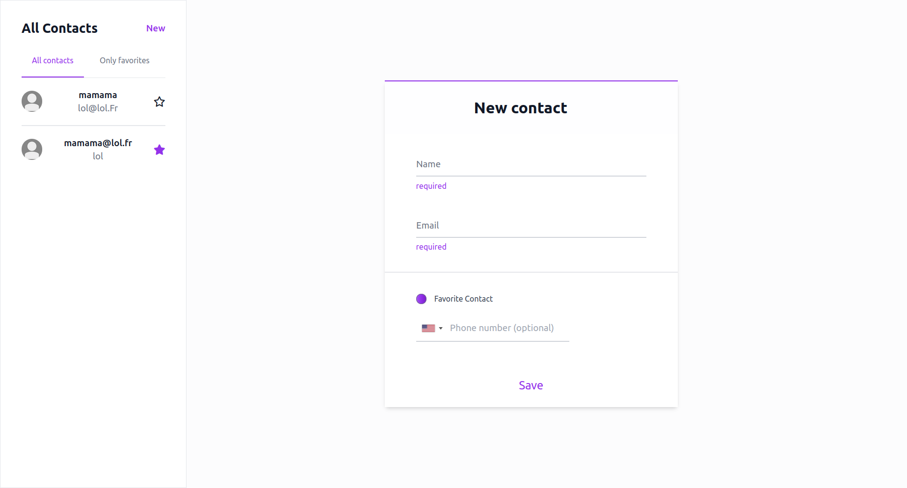

# MyContactBook

## Table of Contents
* [Introduction](./README.md#Introduction)
* [Run](./README.md#Run)
* [Features](./README.md#Features)

## Introduction


*demo*

I did this application in [Elm](https://guide.elm-lang.org/).

>If you aren't familiar with the Elm Architecture, please check out [this page quickly](https://guide.elm-lang.org/architecture/).

The program is a single page web application.

Here is the `src` tree :

```
.
├── EditContact.elm
├── Home.elm
├── Id.elm
├── index.html
├── index.js
├── Main.elm
├── Sidebar.elm
├── styles
│   └── styles.css
├── Types.elm
└── Utils.elm

1 directory, 10 files
```
* `Model` and `Msg` are defined in [app/src/Types.elm](./app/src/Types.elm), as both `Main.elm` and `Home.elm` needed them.
* The Elm program uses `localStorage` function of the Browser through `ports`. Its definition, encoding and decoding are in [app/src/Home.elm](./app/src/Home.elm)
* `EditContact.elm` and `Sidebar.elm` are just extensions of `Home.elm` but as their name explicitly indicate they have different functions.


## Run
### Prerequisites
Make sure you have docker installed on your machine.
First clone the repo, and then enter in its directory.
```bash
$ docker build -t my-contact-book
$ docker run -dp 1234:1234 app
```
There you go ! You can now go to [http://localhost:1234](http://localhost:1234).

## Features

- [x] User can add contact information where :
    - [x] Name
    - [x] Email
    - [x] phone number
- [x] User is able to favorite a contact
- [x] User is able to toggle "favorite" on and off on the contact list.
- [x] When contact is unfavorited, it disappears from the list of favorite contacts.
- [x] Modifying an existing contact.
- [x] Data is persistent thanks to local storage
- [ ] Mobile friendly
